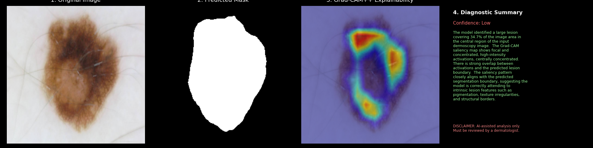
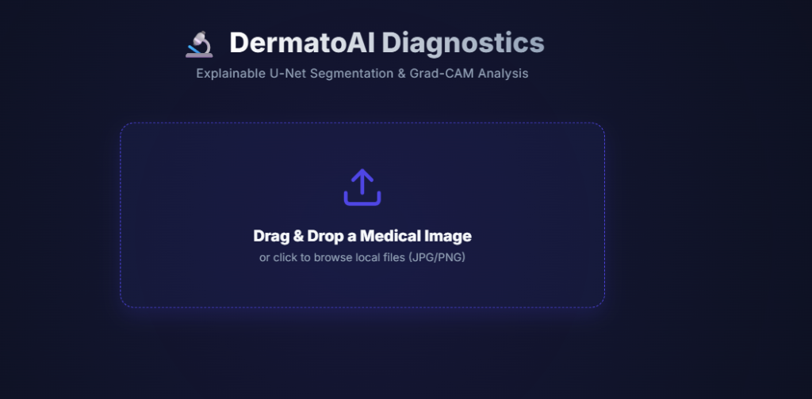
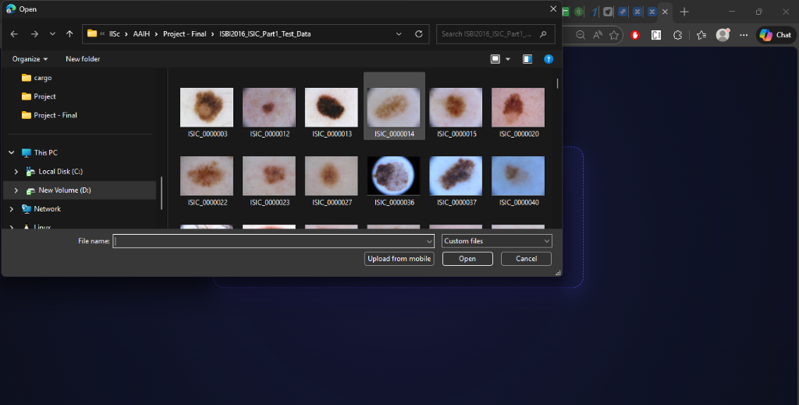
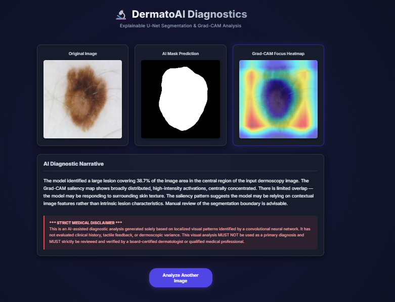
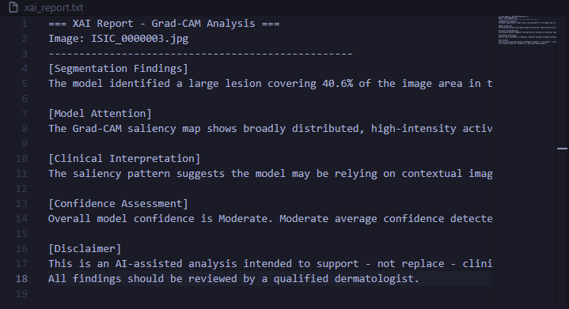

<div align="center">
  
  <h1>🩺 Explainable AI for Skin Lesion Segmentation</h1>
  <p><i>A clinical-grade, end-to-end framework combining U-Net pixel-level segmentation with Grad-CAM++ visual explainability and semantic diagnostic reporting.</i></p>

  [](https://www.python.org/)
  [](https://pytorch.org/)
  [](https://flask.palletsprojects.com/)
  [](https://challenge.isic-archive.com/)

</div>

---

## 📖 Overview

Automated skin cancer segmentation is a critical medical problem. However, modern deep learning architectures often act as closed "black boxes," making it difficult for medical professionals to trust its inferences. 

This project bridges the gap by building a complete **Explainable AI (XAI)** system. By pairing a custom U-Net model built from scratch with **Grad-CAM++** to highlight internal decision-making features, this framework offers both high-precision boundary maps and natural language reasoning behind its analysis.

## ✨ Key Features

- **Custom BCE + Dice Loss:** Handles severe background-to-foreground class imbalance effectively without data bias.
- **Explainable Heatmaps:** Grad-CAM++ visualization maps the U-Net bottleneck attention natively.
- **Smart Post-Processing:** Otsu dynamic thresholding, center-weighted gaussian filtering, and connected-components algorithms map raw medical photos perfectly.
- **Interactive Web UI:** Drag-and-drop diagnostic pipeline wrapped in a lightweight Flask backend.

## 🚀 Interactive Diagnostic Web App

A clean, responsive interface designed specifically for rapid clinical review.

<div align="center">
  
  <p><b>Step 1:</b> Drag-and-drop landing page for image upload.</p>
</div>

<br>

<div align="center">
  
  <p><b>Step 2:</b> The user selects a dermoscopy image from their device.</p>
</div>

<br>

<div align="center">
  
  <p><b>Step 3:</b> The backend processes the image through the segmentation and Grad-CAM pipeline.</p>
</div>

<br>

<div align="center">
  
  <p><b>Step 4:</b> Results displayed with predicted mask, heatmap overlay, and natural language explanation for clinical review.</p>
</div>

## 📊 Model Performance

Evaluated strictly against the unseen **ISBI 2016 Challenge Test Dataset**:

| Metric | Score | 
| :--- | :---: | 
| **Dice Coefficient (F1)** | `0.8755` | 
| **Intersection over Union (IoU)** | `0.8013` |  
| **Precision** | `0.8937` | 
| **Recall (Sensitivity)** | `0.8976` |

*Note: This custom implementation actively outperforms traditional pre-trained baselines (such as FCN-8s, SegNet, and Vanilla ResNet U-Nets) by combining a robust hybrid loss function directly on domain-specific medical imagery.*

## 💻 Tech Stack & Architecture

* **Core Machine Learning:** PyTorch, Torch-XLA (TPU Integration)
* **Computer Vision:** OpenCV, Pillow, Numpy, Matplotlib
* **Web API:** Flask framework with HTML5/CSS3 frontend.
* **Network Architecture:** Deep 4-Block Downsampling U-Net (3 → 64 → 128 → 256 → 512) feeding into a robust 1024-channel bottleneck.

## ⚙️ Installation & Usage

1. **Clone the Repo:**
   ```bash
   git clone https://github.com/Onkarbiyani/AAIH.git
   cd AAIH
   ```

2. **Install Dependencies:**
   ```bash
   pip install -r requirements.txt
   ```

3. **Launch the Web Application:**
   ```bash
   python app.py
   ```
   *Navigate to `http://127.0.0.1:5000` via your web browser to access the drag-and-drop interface.*
   
4. **Run Terminal Inference:**
   To test directly from the command line without the web app:
   ```bash
   python inference.py --image path/to/your/image.jpg
   ```
